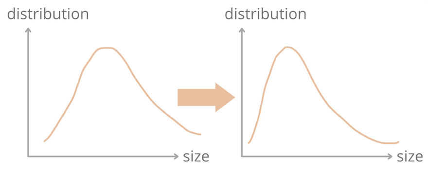
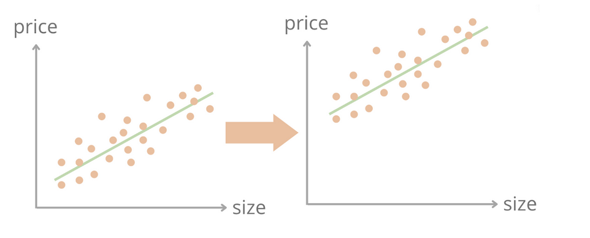
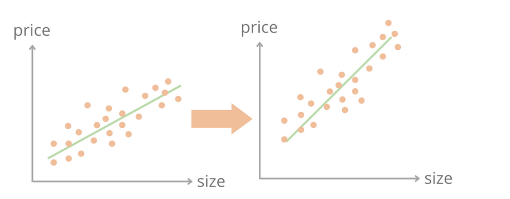
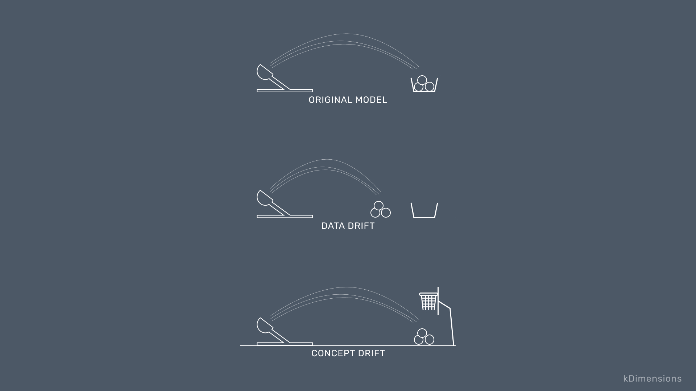
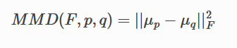
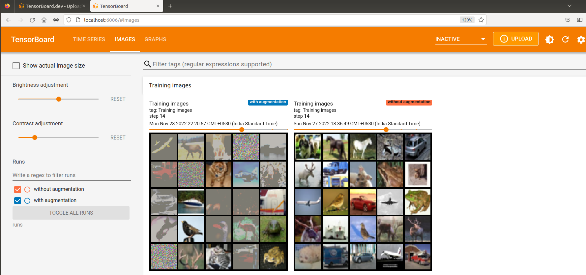

<div align="center">

## Model Drift

</div>

In machine learning, model drift means that the machine learning model becomes less and less accurate due to the changes in the statistical properties of the input features, target variables, or relationships among variables. The data on which the machine learning model is trained is called training data or source data. The data on which the model is trying to predict is called serving data or target data. The training/source data distributions might be different from the serving/target data distributions.

### Types of Drift

#### Data Drift

Data drift happens when p(X) changes but p(y|x) remains the same.

For example, in a house price prediction model, X could be a set of features of houses (e.g., number of bedrooms, size, location), and y could be the house price. One pair of (X, y) indicates one house record in the dataset. p(X) and p(y) are the probabilities of observing house features X and house price y respectively, also known as the marginal probability or prior probability. p(y|X) is the conditional distribution of house prices given house features. Data dirt is when the marginal distribution of the input house features changes, but the conditional distribution of house prices given house features stays the same.



#### Label Drift

Label drift happens when p(y) changes but p(x|y) remains the same, i.e, same inputs expecting different outputs.

In the house price prediction example, the house price distribution p(y) could change after when the model was trained previously. For example, house prices have significantly increased during the pandemic, resulting in the house price distribution shifting towards a higher value.



#### Concept Drift

Concept drift happens when p(y|X) changes but p(X) remains the same.

In the house price prediction example, the conditional probability of house prices given house features p(y|X) could change. Let’s reconsider the previous example. Imagine that the distribution of the house sizes does not change. Because people prefer larger houses now, larger houses become more expensive. The conditional probability of housing price given house sizes could change, especially for larger houses.



#### Data Drift Vs Concept Drift



Data Drift - The input data has changed. The distribution of the variables is meaningfully different.

Concept Drift - Distributions might remain the same. Instead, the relationships between the model inputs and outputs change.

### Maximum Mean Discrepancy (MMD)

The [Maximum Mean Discrepancy (MMD)](http://jmlr.csail.mit.edu/papers/v13/gretton12a.html) detector is a kernel-based method for multivariate 2 sample testing. The MMD is a distance-based measure between 2 distributions _p_ and _q_ based on the mean embeddings in a reproducing kernel Hilbert space :



Maximum mean discrepancy (MMD) is a statistical test used to determine whether given two distribution are the same. Or in simpler terms MMD is a distance (difference) between feature means. MMD is very commonly used in GANs to check how good of images that GAN produces with respect to the input dataset that it was trained on. (Refer this [link)](https://www.onurtunali.com/ml/2019/03/08/maximum-mean-discrepancy-in-machine-learning.html)

For MMD as loss function, refer to this [link](https://github.com/ZongxianLee/MMD_Loss.Pytorch/blob/master/mmd_loss.py)

For more info on MMD, refer to this [link](https://github.com/TorchDrift/TorchDrift/blob/master/notebooks/note_on_mmd.ipynb)

### Drift Detection Results

Refer this [notebook](./DriftDetection.ipynb)

Here I have initially trained a CNN model on the CIFAR10 data without any augmentation. Then I tried to detect if there is drift in data by comparing the reference distribution with some samples from test set. There was no drift here.

```python
{'data': {'is_drift': 0,
  'distance': -0.002507328987121582,
  'p_val': 0.7900000214576721,
  'threshold': 0.05,
  'distance_threshold': array(0.00439334, dtype=float32)},
 'meta': {'name': 'MMDDriftTorch',
  'online': False,
  'data_type': None,
  'version': '0.10.4',
  'detector_type': 'drift',
  'backend': 'pytorch'}}
```

After that, some random brightness and contrast was added to test samples and again compared with reference images. There was drift in data this time

```python
{'data': {'is_drift': 1,
  'distance': 0.1609412431716919,
  'p_val': 0.0,
  'threshold': 0.05,
  'distance_threshold': array(0.00813687, dtype=float32)},
 'meta': {'name': 'MMDDriftTorch',
  'online': False,
  'data_type': None,
  'version': '0.10.4',
  'detector_type': 'drift',
  'backend': 'pytorch'}}
```

I also added some Gaussian noise to the test set and did the comparison. There was drift this time also

```python
{'data': {'is_drift': 1,
  'distance': 0.12979304790496826,
  'p_val': 0.0,
  'threshold': 0.05,
  'distance_threshold': array(0.00495988, dtype=float32)},
 'meta': {'name': 'MMDDriftTorch',
  'online': False,
  'data_type': None,
  'version': '0.10.4',
  'detector_type': 'drift',
  'backend': 'pytorch'}}
```

Then, I trained the CNN model with both augmentations (random brightness/contrast and Gaussian noise) and repeated the above tests. This time there was no drift in data detected. Here are the results

```python
# Comparison of test set images augmented with random brightness and contrast to the reference distribution
{'data': {'is_drift': 0,
  'distance': 0.002732396125793457,
  'p_val': 0.1899999976158142,
  'threshold': 0.05,
  'distance_threshold': array(0.00803816, dtype=float32)},
 'meta': {'name': 'MMDDriftTorch',
  'online': False,
  'data_type': None,
  'version': '0.10.4',
  'detector_type': 'drift',
  'backend': 'pytorch'}}

# Comparison of test set images augmented with Gaussian noise to the reference distribution
{'data': {'is_drift': 0,
  'distance': 0.00028818845748901367,
  'p_val': 0.33000001311302185,
  'threshold': 0.05,
  'distance_threshold': array(0.00526458, dtype=float32)},
 'meta': {'name': 'MMDDriftTorch',
  'online': False,
  'data_type': None,
  'version': '0.10.4',
  'detector_type': 'drift',
  'backend': 'pytorch'}}
```

Here are some image samples used for training. ([Tensorboard Link](https://tensorboard.dev/experiment/WfxlPUd1RQigOy2WpvrBww/#scalars))


